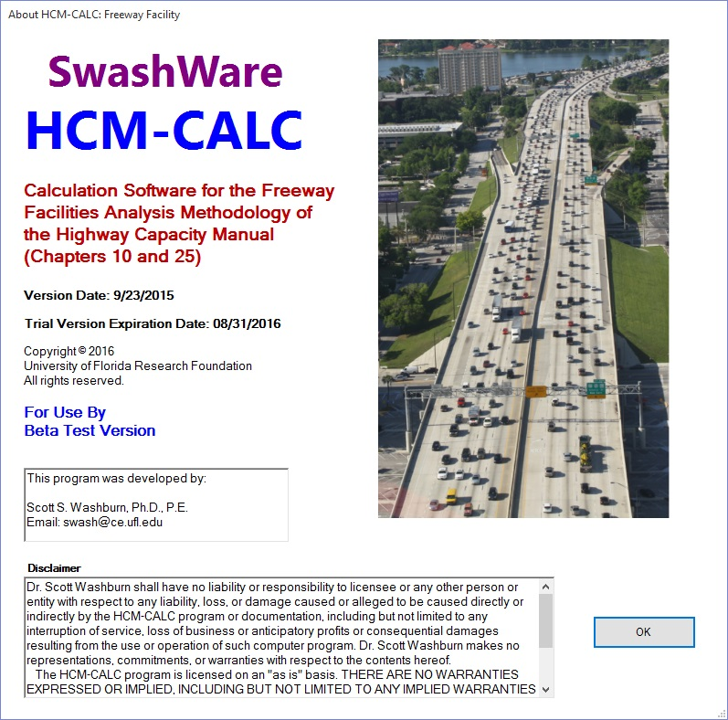

<h1>Freeway Facility</h1>

This module performs level of service analysis for a freeway facility. The underlying analysis methodologies are based on Chapters 10 and 25 of the HCM (5th and 6th Editions).

<a href="HCMCalc_FreewayFacility_UserGuide.pdf">User Guide</a>

