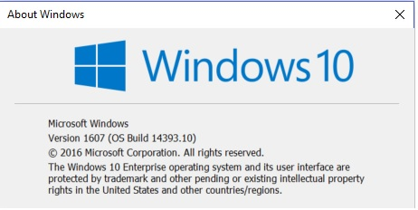

# HCM-CALC
Calculation Software for the Uninterrupted Flow Analysis Methodologies of the Highway Capacity Manual: 5th (2010) and 6th (2016) Editions

Developed by <a href="https://faculty.eng.ufl.edu/scott-washburn/">Dr. Scott Washburn</a>

HCM-CALC is currently available (at no cost) from the <a href="https://www.microsoft.com/en-us/store/p/hcm-calc/9nblggh538w4">Microsoft Store</a>

Note that HCM-CALC only runs on the Windows operating system. To install HCM-CALC from the Microsoft Store, your computer must be running at least the Windows 10 Anniversary Update operating system. The Windows 10 Anniversary Update version is indicated by one of two numbers: 1607 and/or 14393, as shown in the dialog below.  This dialog can be viewed by running the 'winver' utility (through the command prompt or typing into the search bar).

To install on older versions of Windows, please contact Dr. Washburn to obtain a different installation package for the software. If you have Windows 10 but your employer does not allow access to the Microsoft Store, the alternative installation method also works for Windows 10. Instructions for this other installation method are <a href="AltInstallation.md">here.</a> This install package will be made available as direclty-downloadable release in the near future.

See the latest version release notes <a href="LatestReleaseNotes.md">here.</a>

* <a href="ExampleProblems\ExampleProbs.md">Example Problems with HCM-CALC</a>
* <a href="HCM-CALC Screenshots.pdf">More information about the freeway segment modules</a>
* <a href="FreewayFacility\FreewayFacility.md">More information about the Freeway Facility module</a>
* <a href="TTR_ATDM\TTR_ATDM.md">More information about the Freeway Facility TTR/ATDM module</a>
* <a href="https://www.youtube.com/channel/UCNZCZ00coz8na0MtHBhdetg/videos.html">Introductory videos on HCM-CALC installation and operation</a>
* <a href="http://www.trb.org/main/blurbs/175169.aspx">TRB web page for HCM 6th Edition</a>