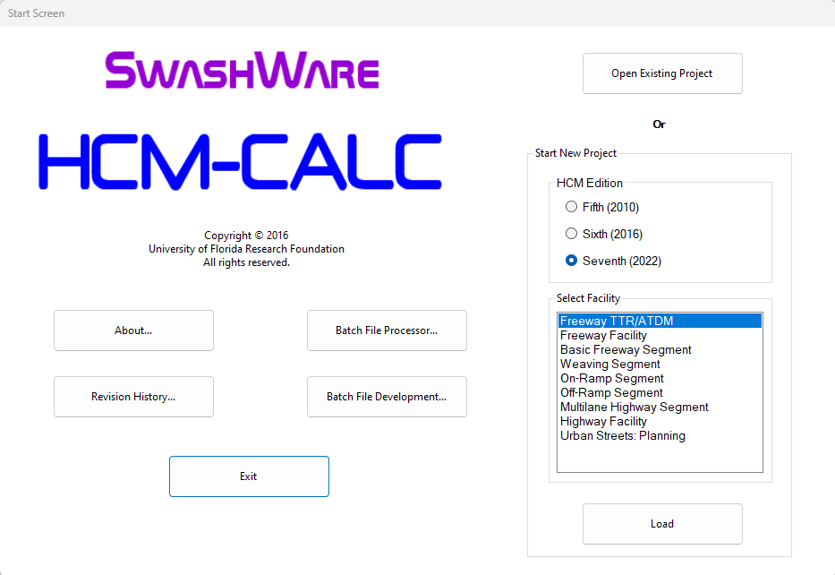

# HCM-CALC
Calculation Software for the Uninterrupted Flow Analysis Methodologies of the Highway Capacity Manual: 5th (2010), 6th (2016), and 7th (2022) Editions

Developed by <a href="https://faculty.eng.ufl.edu/scott-washburn/">Dr. Scott Washburn</a>

While HCM-CALC is available (at no cost) from the <a href="https://www.microsoft.com/en-us/store/p/hcm-calc/9nblggh538w4">Microsoft Store</a>, this version is no longer supported. An installation package for the program will be made available directly from this GitHub site. It is expected that this will be available in late Spring 2024, coinciding with the release of the final publication material for project <a href="https://apps.trb.org/cmsfeed/TRBNetProjectDisplay.asp?ProjectID=4747">NCHRP Project 08-135</a>. In the meantime, if you would like a copy of the program, just contact Dr. Washburn (swash@ce.ufl.edu) to receive the installation package. Installation instructions are <a href="InstallInstructions.md">here</a>.

See the latest version release notes <a href="LatestReleaseNotes.md">here.</a>

* <a href="ExampleProblems\ExampleProbs.md">Example Problems with HCM-CALC</a>
* <a href="HCM-CALC Screenshots.pdf">More information about the freeway segment modules</a>
* <a href="FreewayFacility\FreewayFacility.md">More information about the Freeway Facility module</a>
* <a href="TTR_ATDM\TTR_ATDM.md">More information about the Freeway Facility TTR/ATDM module</a>
* <a href="https://www.youtube.com/channel/UCNZCZ00coz8na0MtHBhdetg/videos.html">Introductory videos on HCM-CALC installation and operation</a>
* <a href="https://nap.nationalacademies.org/catalog/26432/highway-capacity-manual-7th-edition-a-guide-for-multimodal-mobility">TRB web page for HCM 7th Edition</a>