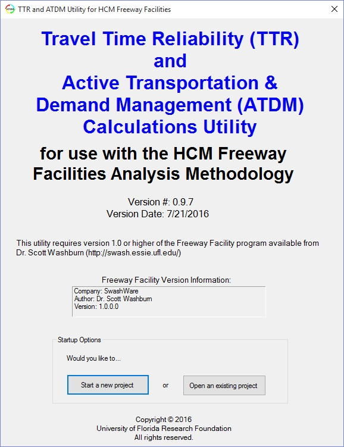
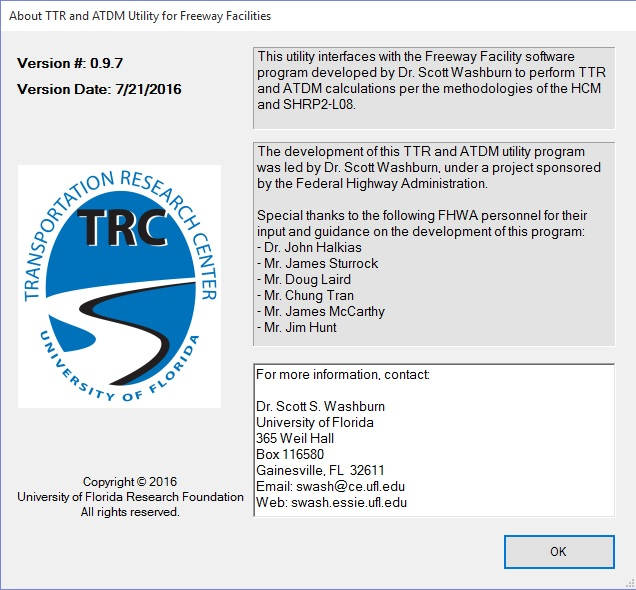

<h1>Travel Time Reliability (TTR) and Active Transportation & Demand Management (ATDM)</h1>

<b>This module interfaces with the Freeway Facility module of HCM-CALC to perform TTR and ATDM calculations.</b>  

* <a href="TTR_ATDM User Guide.pdf">User Guide</a>
* <a href="Sun Wei Thesis.pdf">Sun Wei (former graduate student) thesis on program development</a>

